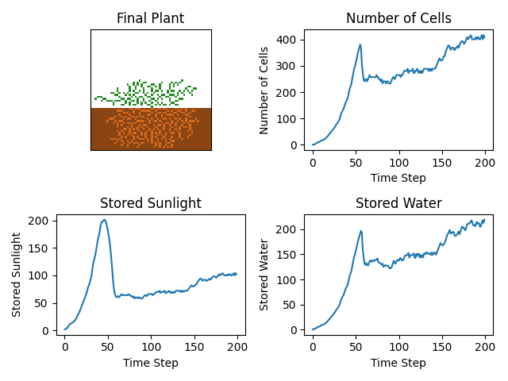

# EvoPlantSim
## Goal
Create a "plant" that lives on a 2d grid and evolves via a genetic algorithm. When run for many generations, the algorithm will produce an approximation of the best possible plant as defined by some fitness function.

## Part 1: "simple simulator.py"
### Introduction
After watching a great number of videos on youtube about cellular automata and seperately about genetic algorithms, I was inspired to begin my own project. I've been interested in both topics off and on for a while, so working on a project that involved both and that also would allow me to practice Python programming seemed like a good idea.

### High-Level Plant Behavior
The plant consists of two materials: ROOT and PLANT

The (non-plant) world consists of two materials: DIRT and AIR

The plant starts as a "seed", which consists of a single ROOT cell replacing a DIRT cell and a single PLANT cell replacing an AIR cell directly above the ROOT.

During each time step, the following occurs:
1. Each DIRT cell gives a certain amount of water to the plant if it is adjacent to a ROOT cell.
2. Each PLANT cell gives a certain amount of sunlight to the plant if it is the highest PLANT in its column.
3. In order from oldest to newest Each ROOT and PLANT cell consumes a certain amount of sunlight and water in order to stay alive. Each cell that didn't consume enough sunlight or water dies and is replaced by AIR or DIRT depending on the cell's type.
4. Each surviving PLANT and ROOT cell attempts to grow a new cell of the same type in an adjacent spot. A new cell can only be grown in spots with no adjacent cells except for the new cell's parent cell.

After all time steps have occured, an image of the final form of the plant is displayed alongside graphs which show sunlight, water, and total cells plotted for each time step.

### Implementation
The world is stored as a square numpy array of int32 numbers. AIR, DIRT, ROOT, and PLANT are defined as specific int32 values in order to make the code more readable. There is also a "delta" array of the same dimensions as the world array. This delta array is used to store each planned change to the world array during each time step so that all changes can be applied at the same time.

First, every cell in the world above the dirt_level is set to AIR, then every cell below the dirt_level is set to DIRT. The seed (as described in the Behavior section) is then placed.

Next, the main loop of the program begins:

1. Water and sunlight are collected as described in the Behavior section. The amount of water and sunlight the plant gains from DIRT or from the top PLANT in each column is defined as water_increment and sunlight_increment.
2. Cells consume those resources or die as described in the Behavior section. Cell data is stored in a deque data structure in the form (PLANT|ROOT, (Row, Column)). The deque stores the order that PLANT and ROOT cells were placed as part of its structure, so removing the most recent cell is as simple as calling pop() on the deque and setting the value of the world at that cell's coordinates to DIRT or AIR.
3. Each cell in the plant attempts to grow a new cell of the same type in an adjacent cell. The parent cell randomly selects an target cell from the 3x3 neighborhood around it. It then checks the 3x3 neighborhood around the target cell in the world array to make sure that the only adjacent PLANT or ROOT is the parent cell. Finally it checks the delta array to make sure no other cell will be grown in the 3x3 neighborhood around and including the target cell. If both conditions are satisfied, a "2" is written to those coordinates in the delta array. The values of DIRT, ROOT, PLANT, and AIR were chosen carefully so that ROOT = DIRT + 2 and PLANT = AIR + 2.
4. The value of each cell in the delta array is added to the corresponding cell in the world array. Then the delta array is filled with zeros.

### Results

  
Click to view an example of a plant, and graphs of water, sunlight, and total cells over time.

  

### Notes, Challenges, and Future Plans
1. The algorithm described above is not a genetic algorithm. The next iteration of this project will contain some genetic component.
2. I initially decided to create a "Cell" class and represent the world using a Python list, but after realizing how little state I actually needed to store about each cell, I decided to instead use one or more numpy arrays to take advantage of the speed increase that is enabled by having continuous memory locations.
3. Currently a parent cell only checks one adjacent position for a target cell, and places no child cell if that position is invalid. It might produce more interesting behavior to allow it to check each adjacent position in a random order. I will need to figure out a way to do this without generating several random numbers (in the worst case) per parent cell.
4. The algorithm is currently not as efficient as it could be. Rather than wasting time in trying to optimize this version, I will instead focus on producing the next version and optimizing it if necessary.
    - It iterates over every cell rather than only every PLANT and ROOT cell. This could be remedied by iterating over the deque structure after any cells that could not consume enough resources are removed.
    - Slicing the numpy arrays to check for neighbors when growing cells simplifies the code, but based on my reading it might produce a copy of all or part of the world array under some circumstances (advanced indexing). More reading is required.
5. This version of the algorithm stores the amount of "unconsumed" sunlight and water that the plant has as a pair of values. In future versions of the algorithm, I'd like to simulate the movement of "packets" of sunlight and water through the plant by storing additional information for each cell: the amount of sunlight and water stored in that cell, and which cell(s) the plant will pass excess resources to when it has consumed what it needs. This will probably increase the runtime (and maybe the complexity) of the part of algorithm that handles cell resource consumption and death, but my hope is that it will force plants to optimize their structure once I've implemented an actual genetic algorithm.
6. I'm having a hard time figuring out what I should allow a plant's genes to control. The simplest thing I can think of is to let them influence which direction the plant wants to grow (which I expect will cause the plant to grow wide rather than tall in order to optimize its structure, assuming the fitness function rewards a higher "Resource Collecton/Plant Cell" ratio). I can kind of see how a neural network would be useful in this type of situation, so maybe the third iteration of this algorithm will incorporate a probabilistic neural network and the plants genetic code will determine the weight of the connections between each neuron. The most obvious network I can think of will be used for determining the position in which a new cell should be grown: it would take in the materials that make up the 5x5 neighborhood around a parent cell and output a score for each of the 8 potential positions for a child cell. It would also be interesting to have a two seperate genomes: one for PLANT and one for ROOT, since they operate independently.
7. I'd like to store plant history and create some way to save and play back the growth (and statistical information) of a plant with a specific genetic code. I'm not sure what form the storage or the playback would take.
8. Potential Fitness Functions
    - Efficiency (maximize): Resource collection/total plant cells
    - Size (maximize): Most plant cells after a certain number of steps
    - Speed (minimize): The number of steps the plant takes to be able to collect a certain amount of sunlight and water
    - Flowers (maximize): The plant can choose to grow a flower instead of another material. The flowers consume resources as normal, but serve no purpose other than giving it a higher fitness score (they don't collect sunlight or water) and cannot produce any child cells. This is similar to the Size function, but differs in that the position of the flowers affects the ability of other cells to collect light and of the plant to expand in certain directions.
9. I'm also curious about the effect of a genome that controls the plant's abilities: how much sunlight a cell can collect per step, how much water a cell can collect per step, how many children a cell can have, how much of each resource a cell can store, how much of each resource a cell consumes to stay alive. I'm not sure how to balance this, as it seems like the plant would want every one of these values either as high or as low as possible. Maybe the plant could have some amount of "points" that it allocates between the different genes. It might be a good proof of concept to show that the genetic algorithm works, at least.

### Final Thoughts

I'll update this file with information about the next iteration of the algorithm once I have made some progress on it. I'll also try to check off potential features mentioned above once I have incorporated them into the program.

---
